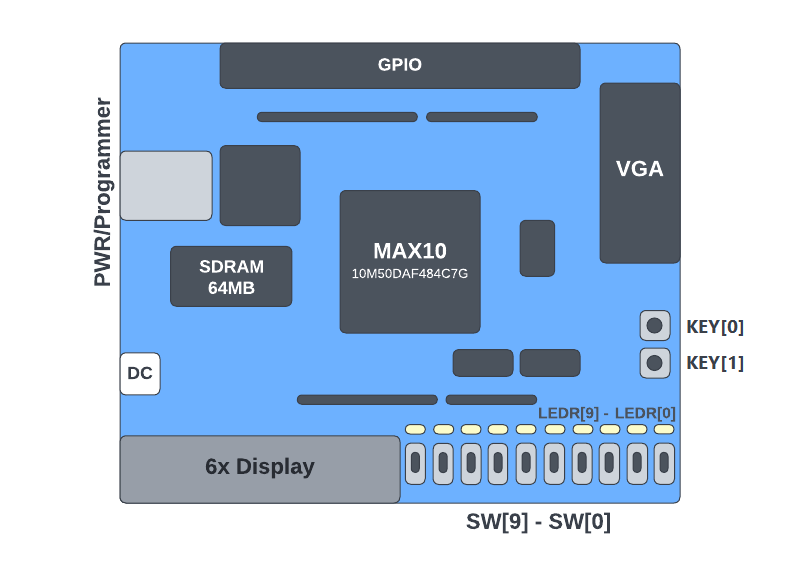
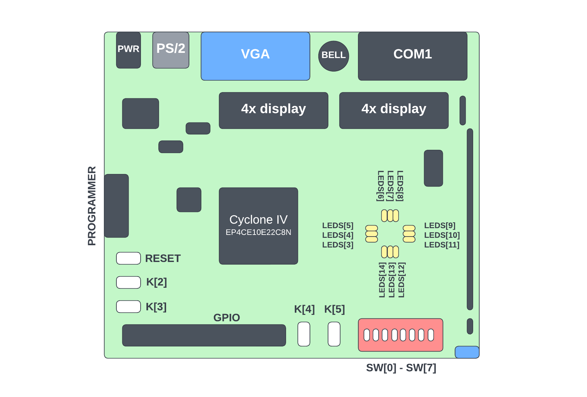

# Installation procedure

You can install all the software either **natively on your PC (follow 2.0-native-installation)** or use a well-configured **Virtual Machine (follow 2.1-vm-installation and 2.2-vm-image-import)**.

[**FPGA (Field-Programmable Gate Array)**](https://en.wikipedia.org/wiki/Field-programmable_gate_array) is an integrated circuit that allows the developers to design a custom digital logic in the field.
  

**[Short video with elegant description of what is FPGA](https://youtu.be/iHg0mmIg0UU)**

# FPGA vs General-Purpose Processor (GPP)

1. ✅FPGA is reprogrammable: you define your own digital logic using [HDL](https://en.wikipedia.org/wiki/Hardware_description_language)
2. ✅FPGA has changeable ISA: you define your own [ISA](https://en.wikipedia.org/wiki/Instruction_set_architecture) by designing logic circuits
3. ✅FPGA is faster: generic architecture of GPP leads to performance loss in comparison with problem-specific optimized architectural solutions on FPGA and HDL
4. ❌FPGA is expensive: depending on model and brand, but typically GPPs are cheaper
5. ❌FPGA is energy inefficient: GPPs consume less power
# Overview of MAX10 and Cyclone IV E

You will use the following 2 FPGA boards:

1. [**MAX10 DE10-Lite**](https://www.terasic.com.tw/cgi-bin/page/archive.pl?Language=English&CategoryNo=218&No=1021&PartNo=2#contents) **(`10M50DAF484C7G`)**
2. [**Cyclone IV E A4-CE10**](https://ark.intel.com/content/www/ru/ru/ark/products/210472/cyclone-iv-ep4ce6-fpga.html) **(`EP4CE10E22C8N`)**

# Recommended materials
1. [Andrew Moore & Ron Wilson "FPGAs for dummies" - a free online book from Intel](https://majed.xyz/download/414/)
2. [Intel Quartus Prime Pro and Standard Software User Guides](https://www.intel.com/content/www/us/en/support/programmable/support-resources/design-software/user-guides.html)
3. [Verilog tutorial](https://www.chipverify.com/tutorials/verilog)
4. [DE10-Lite User Manual](https://www.terasic.com.tw/cgi-bin/page/archive.pl?Language=English&CategoryNo=234&No=1021&PartNo=4#contents)
5. [EP4CE10 User Manual](https://disk.yandex.ru/d/PZazYC5KnkBhwg)
# Comment from the author ([@dmfrpro](t.me/dmfrpro))

I would like to introduce an almost fully **CLI-based guide**, to encourage you to master [Command Line Interface](https://en.wikipedia.org/wiki/Command-line_interface) skills, [Bash](https://en.wikipedia.org/wiki/Bash_(Unix_shell)) or [PowerShell](https://en.wikipedia.org/wiki/PowerShell). They are very useful in IT jobs and will promote you as an IT specialist.
