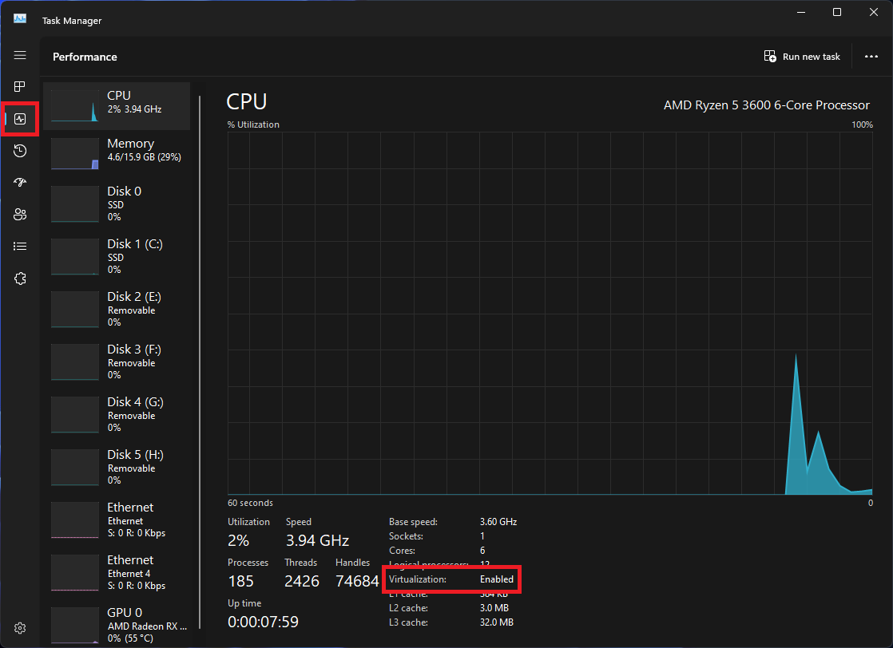

# Check CPU virtualization support (All x86_64 machines)

**Warning! In case you get errors, you must enable CPU virtualization support in BIOS.**
To check if it's already enabled, you can follow the article.
In case virtualization support is disabled, please follow [this guide](https://www.bleepingcomputer.com/tutorials/how-to-enable-cpu-virtualization-in-your-computer-bios/).

## Windows 10-11

You can check virtualization support in `taskmgr` (Ctrl + Shift + Esc -> Performance -> CPU):



You can also check it by running the following command in PowerShell:

```powershell
Write-Host (Get-WmiObject -Namespace "root\cimv2" -Class Win32_Processor).VirtualizationFirmwareEnabled
```

If you see `True` in the output, then virtualization support is enabled.

## GNU / Linux

```bash
egrep 'svm|vmx' /proc/cpuinfo
```

If you see any non-empty output, then virtualization support is enabled.

## MacOS Intel

```bash
sysctl -a | grep machdep.cpu.features | grep VMX
```

If you see any non-empty output, then virtualization support is enabled.

# VirtualBox installation (All x86_64 machines)

**Attention: If you don't have VirtualBox 7 or newer**, you will probably get the following error while importing OVA image:

```shell
0%...10%...20%...30%...40%...50%...60%...70%...80%...90%...100%

Interpreting /home/user/ComputerArchitecture.ova...

VBoxManage: error: Error in  (line 160) -- Invalid value 'WAS' in AudioAdapter/@driver attribute.

VBoxManage: error: /build/virtualbox-dq2OzO/virtualbox-6.1.38-dfsg/out/obj/VBoxAPIWrap/ApplianceWrap.cpp[407] (virtual nsresult ApplianceWrap::Interpret())

VBoxManage: error: Details: code NS_ERROR_FAILURE (0x80004005), component ApplianceWrap, interface IAppliance, callee IAppliance

VBoxManage: error: Context: "Interpret" at line 501 of file VBoxManageAppliance.cpp
```

## Windows 10-11

### 1. Download and install the package

Install VirtualBox latest from [official site](https://www.virtualbox.org/wiki/Downloads).
Windows 11 22H2+ users can install VirtualBox using [Windows Package Manager](https://learn.microsoft.com/en-us/windows/package-manager/)  (`winget`) by running the following command in terminal emulator:

```powershell
winget install -e --id Oracle.VirtualBox
```

### 2. Configure system PATH variable 

Then you should add `%VBOX_MSI_INSTALL_PATH%` to **system** `PATH` variable in order to use VirtualBox CLI utilities like `vboxmanage`, `virtualbox`, *etc*. To do so, run the following command in PowerShell as Administrator:

```powershell
setx /m path ($env:path + ";%VBOX_MSI_INSTALL_PATH%")
```

## GNU / Linux

**Warning! Make sure you have installed `linux-headers` either corresponding to your kernel version or a generic variant.**

### 1. Download and install the package

#### DEB / RPM distributions

Usually `virtualbox` package is outdated in the repositories, hence, install VirtualBox latest from [official site](https://www.virtualbox.org/wiki/Downloads).
#### Arch distributions (following [ArchWiki](https://wiki.archlinux.org/title/VirtualBox))

```bash
# If you use a stock Arch Linux kernel provided by 'linux' package
yay -S virtualbox virtualbox-host-modules-arch

# If you use any other version of linux kernel
yay -S virtualbox virtualbox-host-dkms

# Install unattended templates and extension pack
yay -S virtualbox-unattended-templates virtualbox-ext-oracle
```

### 2. Probe `vboxdrv` module

After installing VirtualBox make sure `vboxdrv` module is working correctly by manually running it. Otherwise, check CPU virtualization support and make sure linux-headers are compatible with your kernel version:

```bash
sudo modprobe vboxdrv
```

### 3.  Add yourself to `vboxusers` group

Finally, add yourself to `vboxusers` group to allow access to USB devices and restart your computer:

```bash
sudo usermod -aG vboxusers $(whoami)
sudo reboot
```

## MacOS Intel

Install VirtualBox latest from [official site](https://www.virtualbox.org/wiki/Downloads).
You can also install VirtualBox using [Homebrew Package Manager](https://brew.sh/) (recommended):

```bash
brew install --cask virtualbox
```

# VirtualBox Extension Pack installation (All x86_64 machines)

**Warning! Extension Pack version must be at least the same as VirtualBox version. To check VirtualBox version, you can run the following command:**

```bash
vboxmanage -version
```

Download VirtualBox Extension Pack from [official site](https://www.virtualbox.org/wiki/Downloads).
Then import it by running the following command:

```bash
vboxmanage extpack install --replace path/to/extension_pack_file.extpack
```

Arch distributions users can install VirtualBox Extension Pack from AUR:

```bash
yay -S virtualbox-ext-oracle
```

# UTM installation (MacOS Apple Silicon only)

Install UTM latest from [official site](https://mac.getutm.app/).
You can also install UTM using [Homebrew Package Manager](https://brew.sh/) (recommended):

```bash
brew install --cask utm
```
