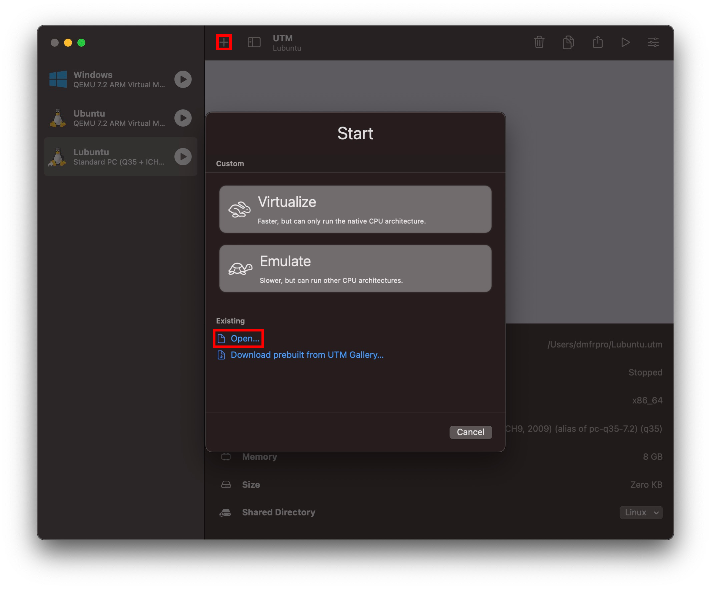
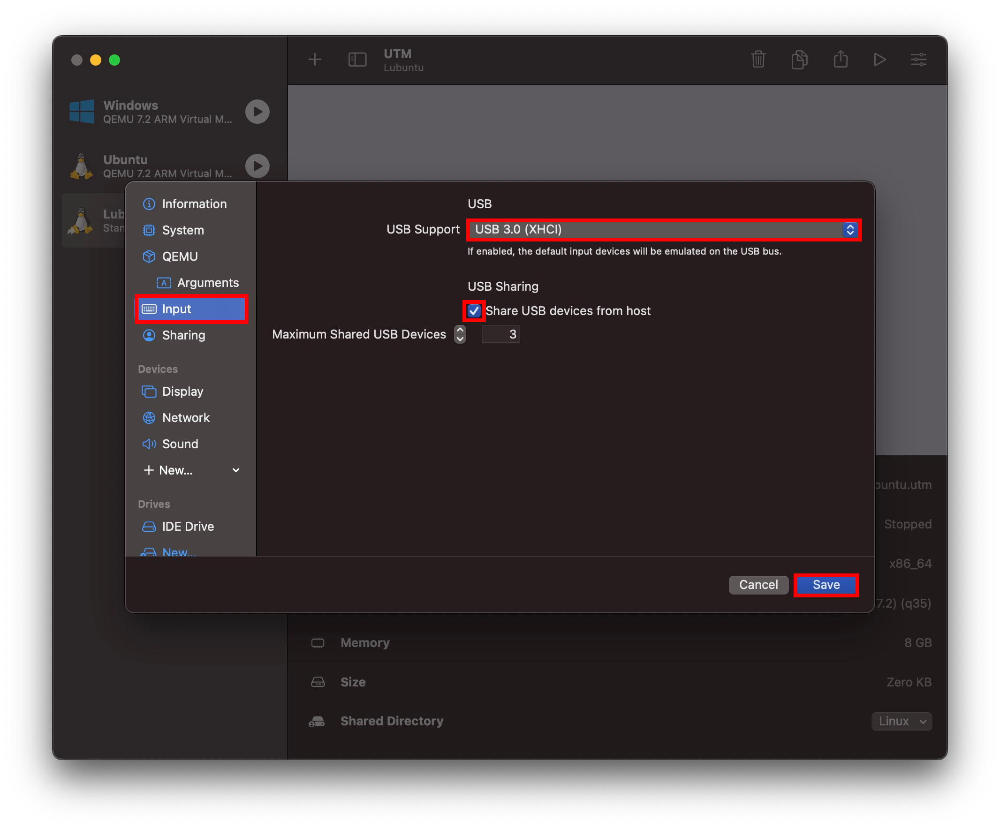

# Download VM image

For all `x86_64` systems you should use **VirtualBox** with corresponding `.ova` image. MacOS Apple Silicon users should use UTM and `.utm` image.
### Download VirtualBox OVA image
### Download UTM Image

# Import OVA image (All x86_84 machines)

Run the following command in terminal emulator:

```bash
vboxmanage import path/to/ComputerArchitecture.ova
```

Then you need to enable **USB2** ([EHCI](https://en.wikipedia.org/wiki/Host_controller_interface_(USB,_Firewire))) and **USB3** ([xHCI](https://en.wikipedia.org/wiki/Host_controller_interface_(USB,_Firewire))) controllers support, and configure USB filters via terminal emulator:

```bash
# Enable EHCI and xHCI support
vboxmanage modifyvm ComputerArchitecture --usbehci on --usbxhci on

# USB-Blaster I
vboxmanage usbfilter add 0 --target ComputerArchitecture --name "Altera USB-Blaster [0400]" --productid 6001 --vendorid 09FB --revision 0400 --serialnumber 91d28408

# USB-Blaster II
vboxmanage usbfilter add 1 --target ComputerArchitecture --name "Altera USB-Blaster(Altera) [0400]" --productid 6001 --vendorid 09FB --revision 0400 --serialnumber 8D815F6B4855
```

# Import UTM image (MacOS Apple Silicon only)

Import UTM image from file via GUI:



Then you need to enable **USB2** ([EHCI](https://en.wikipedia.org/wiki/Host_controller_interface_(USB,_Firewire))) and **USB3** ([xHCI](https://en.wikipedia.org/wiki/Host_controller_interface_(USB,_Firewire))) controllers support for already imported virtual machine via GUI:



# Add Quartus CLI tools to PATH on your VM OS

After you booted VM OS, run the following commands in terminal emulator in order to permanently add Quartus CLI tools to user `PATH` environment variable:

```bash
echo 'export PATH=$PATH:~/intelFPGA_lite/21.1/quartus/bin' >> ~/.bashrc
source ~/.bashrc
```
