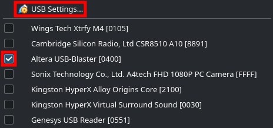
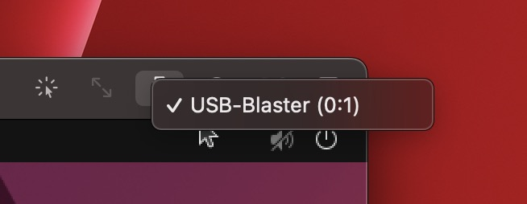

# Troubleshooting from Host OS side

First of all, **connect FPGA board** and make sure USB device is visible on your host OS.
## Windows 10-11

```powershell
Get-PnpDevice -PresentOnly | Where-Object {$_.Class -match "USB" -and $_.Status -match "OK"}
```

You should see `USB-Blaster` devices with status `OK`. Otherwise, you probably forgot to [install USB drivers](3.0-drivers-installation).

## GNU / Linux

```bash
lsusb | grep -i altera
```

If you see any non-empty output, then USB device is detected. Otherwise, you probably forgot to [add yourself to `vboxusers` group](2.1-vm-installation.md).

## MacOS Intel / Apple Silicon

```bash
system_profiler SPUSBDataType | grep -i altera
```

If you see any non-empty output, then USB device is detected. Otherwise, no fixes available at this moment.

# Troubleshooting from VM side

## 1. Make sure VirtualBox recognizes Altera USB devices
### Windows 10-11

Run the following command in PowerShell:

```powershell
vboxmanage list usbhost | Select-String altera
```

If you see any non-empty output, then USB device is detected.

### GNU / Linux and MacOS Intel

Run the following command in terminal emulator:

```powershell
vboxmanage list usbhost | grep -i altera
```

If you see any non-empty output, then USB device is detected. Otherwise, you need to [install USB drivers](3.0-drivers-installation.md). For MacOS Intel and Apple Silicon there are no fixes available at this moment.

## 2. Make sure Altera USB devices are passed to VM OS

For VirtualBox, when running VM OS, on **bottom-right corner**, pass Altera USB Blaster:



For UTM, when running VM OS, on **top-right corner**, pass Altera USB Blaster:



# Troubleshooting from Quartus side

Firstly, make sure Altera USB device is visible:

```bash
lsusb | grep -i altera
```

If you see any non-empty output, then USB device is detected. Otherwise, you probably forgot to [install USB drivers](3.0-drivers-installation.md).

Next, run ***Quartus Programmer*** automatic test:

```bash
quartus_pgm --auto
```

If you see error `quartus_pgm: command not found`, then you forgot to [add Quartus CLI tools to PATH](2.2-vm-import-image). If you see errors like `Unable to lock canin (Insufficient port permissions)`, you probably forgot to [add `udev` rules](3.0-drivers-installation.md).
