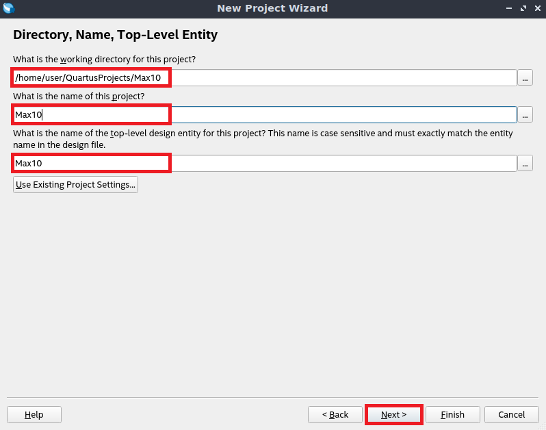

Note: Projects location should not be in intelFPGA_lite directory due to permissions. Hence, a recommended way is to store projects in your home directory:

```bash
# Windows PowerShell
$env:UserProfile\QuartusProjects\Project_Name

# GNU / Linux and MacOS
$HOME/QuartusProjects/Project_Name
```

# MAX10 DE10-Lite project

Open Quartus Prime Lite and create a project by pressing `Ctrl + N` and following screenshots below:



You should create a project from template:


Then you need to select `MAX10 DE10-Lite Base Pinout` template:


Finally, you are ready to start solving assignments.

# Cyclone IV EP4CE10 project

Open Quartus Prime Lite and create a project by pressing `Ctrl+N` and follow screenshots below:


You should create a project from template:


You should firstly install a template from `.par` file (stored at `templates` directory):


Then you need to select newly installed `Altera A-C4E6E10 Base Pinout` template:


Ignore project creation error:


Then you need to open the project manually by pressing `Ctrl + O` and following screenshots below:


Finally, you are ready to start solving assignments.
