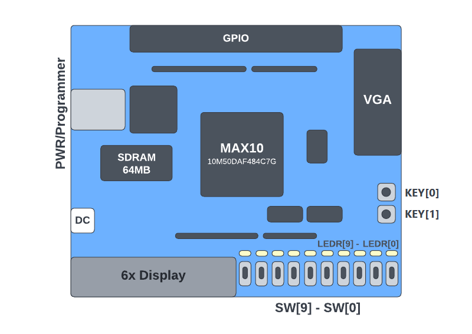
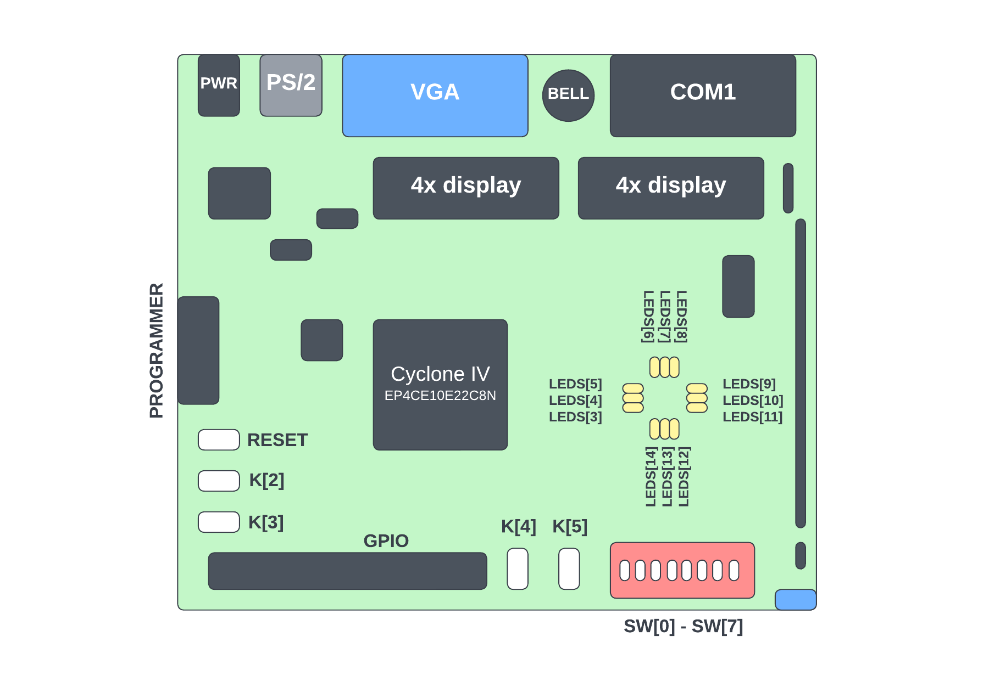

Open the project corresponding to your FPGA board and create a `Block Diagram/Schematic File` by pressing `Ctrl + N`.

Then let's place block diagrams, to open a menu with blocks you should double-click on an empty space:

Let's put two `input` pins, one `output` pin, and one `and2` block by typing them correspondingly in **"Name:"** text field:

Then you need to connect them like on the picture below and name properly according to pin layouts:

**Note: On Cyclone IV all pins have reversed logic. Template solves this problem only for verilog code, not for Block Diagrams. You must append `not` block to every `input` and `output` pins.**

For example, using MAX10 DE10-Lite board, let's use` SW[0]` and `SW[1]` switches for inputs and `LEDR[0]` for output LED, label them as well:

Save the lab file as `Lab0.bdf` by pressing `Ctrl + S`:

Before compilation and flashing a particular file (in our example it is `Lab0.bdf`) you should set  as **Top-Level Entity**:

Then run compilation procedure:

Connect the board to USB port and flash it via **Programmer** utility (make sure it is visible in **Programmer**, otherwise, [troubleshoot drivers](3.1-drivers-troubleshooting.md)):

After a successful flash you can disconnect the board and test your lab. Congratulations, you have just finished Lab 0!

Otherwise, if the flash is failed, refer to the error code provided in **System** events panel:

In most cases you should try to connect the board to another USB port, or in case with Cyclone IV you probably forgot to connect a second USB wire.
