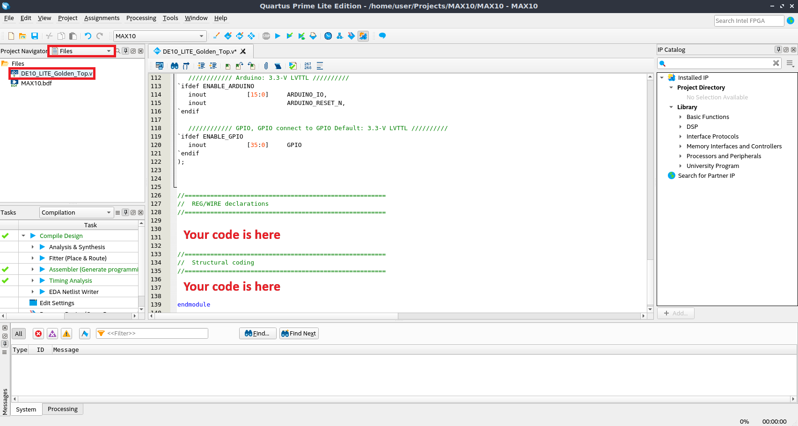
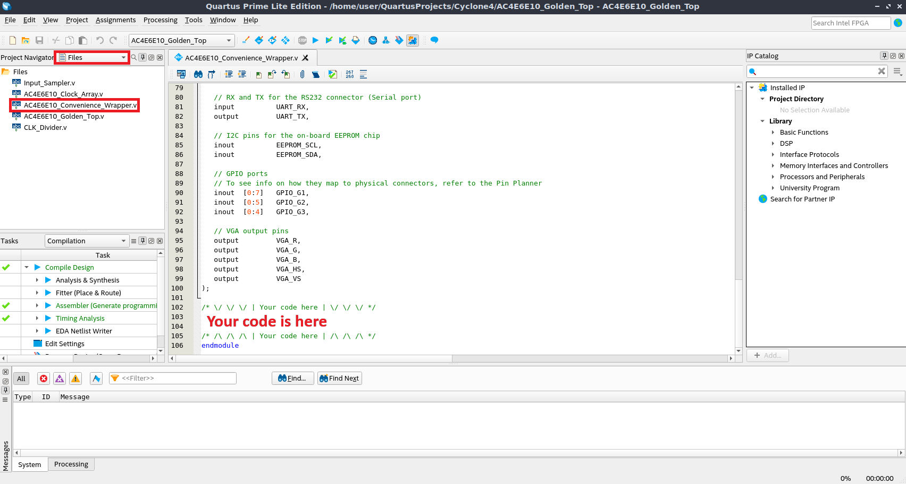

# MAX10 DE10-Lite

You should write verilog code in `DE10_LITE_Golden_Top.v` file:

Then you need to set `DE10_LITE_Golden_Top.v` as **Top-Level Entity** and do compilation and flashing described during [block diagrams creation](5.0-creating-block-diagrams.md).
# Cyclone IV EP4CE10

**Note: Despite Cyclone IV has inverted logic on all pins, `AC4E6E10_Convenience_Wrapper.v` file fixes it, hence you should not invert pins by yourself.**

You should write verilog code in `AC4E6E10_Convenience_Wrapper.v` file:

Then you need to set `AC4E6E10_Golden_Top.v` as **Top-Level Entity** and do compilation and flashing described during [block diagrams creation](5.0-creating-block-diagrams.md).
